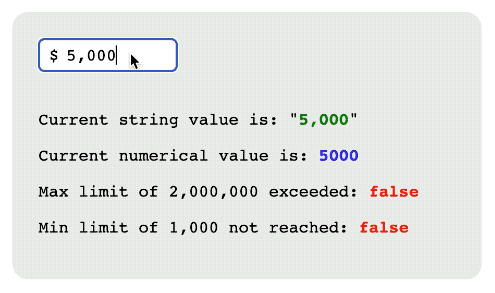

# React Currency Field



This package provides a React component with an input field to be used in React projects,
where the value directly typed by the user is automatically formatted in the local or in a specific currency format.

## 1.4.5 patch release notes
- Both numerical and string values are now updated when the value of the "value" attribute is externally modified.

## Installation
```
npm i @vinzdf89/react-currency-field
```

## Example

A simple usage of this component would be:

```ts
import { useState } from 'react'
import CurrencyField from "@vinzdf89/react-currency-field"

function App() {
    const initialAmount = 5000;

    const [amount, setAmount] = useState<string | number>(initialAmount);
    const [numericalAmount, setNumericalAmount] = useState<number>(initialAmount);

    function changeAmount(e: React.FormEvent<HTMLInputElement>) {
        setAmount(e.currentTarget.value);
    }

    function changeNumericalAmount(newValue: number) {
        setNumericalAmount(newValue);
    }

    return (
        <>
            <CurrencyField value={amount} onChange={changeAmount} onNumericalChange={changeNumericalAmount} />
            <p>String value: {amount}</p>
            <p>Numerical value: {numericalAmount}</p>
        </>
    )
}

export default App;
```

A more complex example can be found in the App.tsx file from the [GitHub project](https://github.com/VinzDF89/react-currency-field).

## Attributes / Properties

| Name | Type | Default | Description |
| ---- | ---- | ------- | ----------- |
| **ref** | Ref\<HTMLInputElement\> | undefined | Used for binding a Ref object to the input field. |
| **id** | string | undefined | For setting the standard HTML "id" attribute. |
| **name** | string | undefined | For setting the standard HTML "name" attribute. |
| **value** | string \| number | undefined | Useful for setting a default value, this should be a value provided by a "useState" hook. It can be either a number or a string (which has to comply with the local format set!). Number is recommended. |
| **placeholder** | string | undefined | For setting the standard HTML "placeholder" attribute. |
| **onChange** | (e: React.ChangeEvent<HTMLInputElement>) => void | undefined | For setting a custom event handler on "change" event, which should update the state passed to the "value" attribute. Look at the example above. |
| **onBlur** | (e: React.FocusEvent<HTMLInputElement>) => void | undefined | For setting a custom event handler on "blur" event, which will be executed after the internal handler has run. |
| **onPaste** | (e: React.ClipboardEvent<HTMLInputElement>) => void | undefined | For setting a custom event handler on "paste" event, which will be executed after the internal handler has run. |
| **className** | string | undefined | Used to set classes to the input field. |
| **locale** | string | undefined | Set the number format. If the attribute is not provided, the format will be fetched from the browser's language preferences. If even this fails, it will be set to 'en-US'. |
| **symbol** | string | '$' | Set the currency symbol to use. |
| **symbolPosition** | 'start' \| 'end' | 'start' | Move the symbol before or after the input field. |
| **decimals** | number | 2 | Number of decimals allowed. |
| **max** | number | 999999999 | The input field will not allow a value that is greater than the one specified by this attribute, and it will call the function (if any) specified by the "onMaxFails" attribute. |
| **min** | number | 0 | If a value to this attribute is provided and it's greater than zero, any value will be allowed in the input field, but in case it's lower than the one specified by this attribute, it will call the function (if any) specified by the "onMinFails" attribute. |
| **disableAutoSymbolPositioning** | boolean | false | By default the currency symbol will be translated to the right, so that it will be graphically shown up as if it were inside the input field (at the beginning or at the end depending on the "symbolPosition" attribute). If set to true, the chosen currency symbol will not be moved, so that the developer would have more freedom to style the component in a different and more precise way in order to make it more suitable and consistent with their graphics. |
| **onNumericalChange** | (newValue: number) => void | undefined | Whenever the user interacts with the input field, the function passed to this attribute will be called and it will contain a parameter representing the value of the field but of number type. |
| **onMaxFails** | (newValue: boolean) => void | undefined | If set, the function will be called every time the user tries to set a number greater than the one specified by the "max" attribute. |
| **onMinFails** | (newValue: boolean) => void | undefined | If set, the function will be called every time the user interacts with the input field, and its value is lower than the one specified by the "min" attribute. |

## Previous releases

## 1.4.4 patch release notes
- Fixed the formatting of the value when changing it externally (through the "value" attribute).

## 1.4.3 patch release notes
- Fixed the wrong positioning and the formatting of the value that was occurring in specific cases.

## 1.4.2 patch release notes
- Fixed the problem that prevented updating the field value by externally calling the set function for the "numericalValue" attribute.
- "numericalValue" attribute marked as deprecated.

## 1.4.1 patch release notes
- Fixed the problem that prevented updating the field value by externally calling the set function.

## 1.4.0 minor release notes
- On blur, the input value is set to zero if empty.
- Automatic symbol positioning logic optimized. Now the symbol position can be changed without graphical issues.

## 1.3.2 minor release notes
- Optimized the value's formatting when deleting the decimal part. Now the decimal separator is kept until it is explicitly removed.

## 1.3.1 patch release notes
- Optimized the cursor position for fields using the "numericalValue" attribute instead of "value"

## 1.3.0 minor release notes
- Optimized the automatic setting of the input's padding where the symbol is placed.
- Added the more generic "disableAutoSymbolPositioning" attribute to use instead of "disableAutoCurrencyPositioning", which is now marked as deprecated.

## 1.2.1 patch release notes
- Fixed vulnerability from the Babel dependency.

## 1.2.0 minor release notes
- Automatic symbol positioning optimized for input fields with full width.
- Symbol now cannot be selected so it doesn't interfere with the input field anymore.
- When typing non-allowed characters (such as letters), the cursor will now keep its position.
- If using only "numericalValue" instead of "value" attribute, or if using "value" and passing it a correct formatted string value, the input field will not trigger an additional rendering on initialization anymore (if you don't need to get the formatted value, it's always recommended to use "numericalValue" attribute).
- When deleting the first digit, the rest of the number is now kept in order to not lose it.
- Several other small changes and improvements + a light refactoring of the code.

## 1.1.0 minor release notes
- Added the more generic "symbol" attribute to use instead of "currency", which is now marked as deprecated.
- Added the new "symbolPosition" attribute, which allows to move the symbol after the field if set to "end" (default is "start").
- Small optimization on keyboard cursor's positioning.
- Code refactoring.